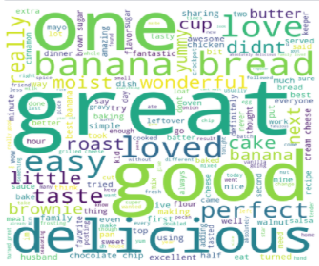

# Recipe dataset exploration 

ECE 143 Winter 22 - Group 12 Project

## Installation

Requires python 3+

Clone the repository using the following command
```
git clone https://github.com/debalina-chowdhury/Recipe-data-exploration.git
```

Install dependencies
```
pip install requirements.txt
```

Download the [recipe dataset](https://www.kaggle.com/shuyangli94/food-com-recipes-and-user-interactions) to `src/data` directory, so that the structure looks like
```
src
├── data
│   ├── RAW_recipes.csv
│   ├── RAW_interactions.csv
│   └── ...
├── rating-trend.ipynb
├── rating_trend.py
└── ...
```

## Aim
Exploration of recipe dataset and building a recommendation system based on insights found with the help of data visualization after data preprocessing

## Problems to be addressed
What are the most important factors that affect the ratings of a recipe?

How do people’s preferences of recipes change over time?

How features such as nutritional value, recipe length, etc. are changing with time?

## Dataset
Food.com Recipes dataset (Food.com Recipes and Interactions | Kaggle). The dataset consists of recipe names, steps, ingredients, preparation time, nutritional value, ratings, etc. from 200k recipes collected over a period of 20+ years. It also contains comments and numerical ratings of 1.1M+ reviews on said collection of recipes.

https://www.kaggle.com/shuyangli94/food-com-recipes-and-user-interactions


## Proposed solution and real world application
As a part of our data analysis, we have taken a look at what recipes are cooked most often within each month and have also analyzed how recipes have change over the years. We have found interesting facts such as the number of ingredients used per recipe has increased over the years and Gingerbread is most popular in December and Irish Soda bread is most popular in March. We also found other interesting information such as Kale having a significant increase in appearance after 2007 all the way to 2014. The complete report of our findings is within our slide. There we have include visuals for the sake of improving intuition of our data.

## Most Common Words Used for Foods with Highest Rating



